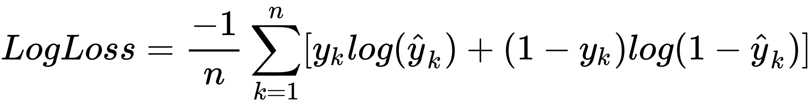
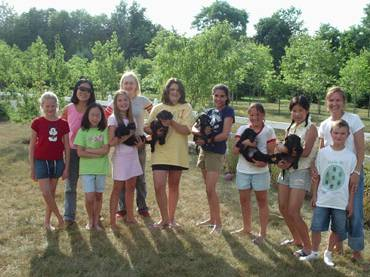
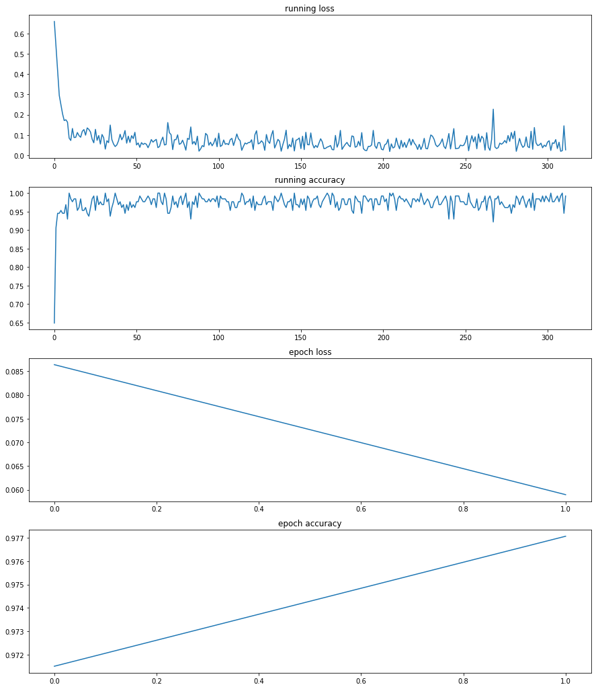
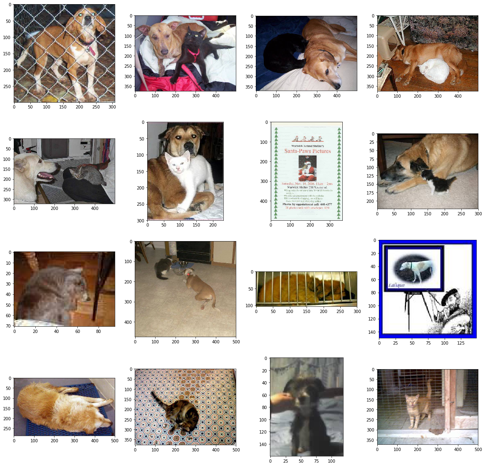
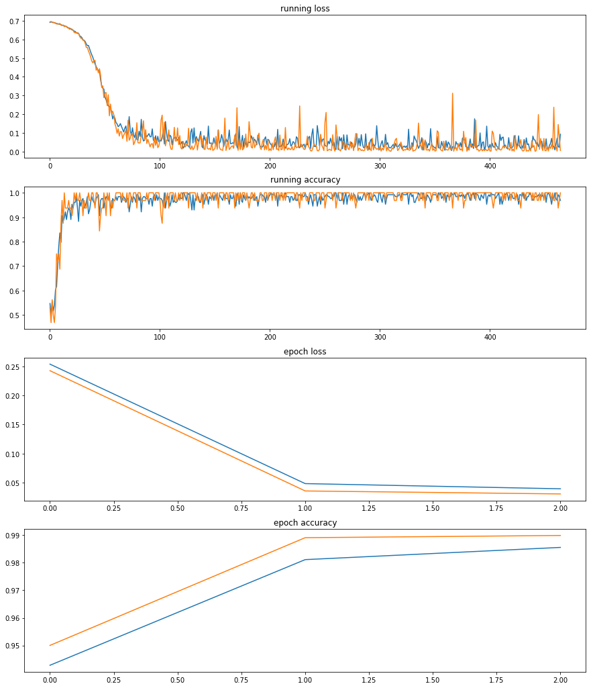

# dogs-vs-cats-redux-kernels-edition

## 项目概述  

本项目是Kaggle上的一个图片分类任务Dogs vs. Cats，任务地址：https://www.kaggle.com/c/dogs-vs-cats-redux-kernels-edition
该项目向我们提供了25000张带标签的猫狗照片作为训练集，以及12500张无标签猫狗照片作为测试集。  

## 问题陈述 

- 该项目要解决的是一个计算机视觉领域的图像分类问题。通过训练一个猫狗图片分类模型，来预测这12500张无标签图是狗的概率。  

- 训练集存在异常图片，要先清洗数据。  

- 使用pytorch等第三方库，通过迁移学习的方式，创建并训练CNN模型，实现图片分类器。  
模型结构：使用ResNet50和Inception_v3预训练模型，作为特征提取器，合并输出特征，再通过全连接层输出分类结果。  

## 评价指标  

本项目任务是一个二分类问题
原题使用***binary cross entropy loss***作为评估指标，非常适合二分类模型loss计算，loss值越小说明模型拟合的分布越接近真实分布，模型表现越好。  

交叉熵损失函数公式定义如下：  

	
# Ⅰ.数据预处理  

### 1、观察数据  
肉眼观察训练集，发现存在一些这样的图片：  

***非猫狗图片***  

***人比狗多***  

***巨大白边***  

一些背景复杂、猫狗占比过小、分辨率过小，或者根本就不是猫狗的图片混杂在训练集中，这会让模型学习到垃圾数据。  

我定义了一个图片过滤器：  
def image_filter(path):  
(***源码见Notebook***)  

**功能：**  
- 去除白边。巨大的白色边缘会导致裁剪时无法剪到完整的猫狗图片；  
- 过滤掉像素小于3600的图片。剩下24973张图。  
(***第一次数据清洗***)

### 2、读取图片  
先将数据集整理成(path,label)格式，**根据文件名读取数据标签**:  
('./dataset/train_sets/dog.2560.jpg', 1), ('./dataset/train_sets/cat.11299.jpg', 0), ……
    
### 3、分割训练集和验证集  
取原训练集80%的样本作为新的训练集。为保证模型能够均衡学习猫狗特征，我们使用数量相等的猫狗图片来训练，猫狗各取80%，剩下20%作为验证集。  
    
### 4、图片变换  
使用torchvision.transforms.Compose( )来组合图片变换函数。图片将分别输入两个子模型，但两个子模型要求的输入尺寸不一致(ResNet50：3 × 224 × 224，Inception_v3：3 × 299 × 299)，需要定义两个不同的transforms组合  

- 定义批次变换函数**batch_transform**：  
**输入：** batch paths和transform  
**输出：** (batch, Channel, width, height)。  

**变换后的图片展示如下**：  
  

### 5、使用torch.utils.data.DataLoader( )加载图片  
训练集图片是按dogs和cats顺序排列的，而DataLoader有shuffle功能打乱图片顺序，避免模型“偏科”。  

# Ⅱ.搭建网络  

### 1、定义网络  
定义混合模型类FusionNet，该类包含预训练CNN模型：**ResNet50**和**Inception_v3**，因为预训练的参数已经很好，我们只对模型finetune。  
根据情况冻结模型前面几层参数，关闭Inception_v3的辅助分支。融合ResNet50和Inception_v3的特征输出，在其后添加自定义的fully connected layer：  
classifier=nn.Sequential(nn.BatchNorm1d(4096),
                                      nn.Linear(4096,2048),
                                      nn.ReLU(),
                                      nn.Linear(2048,1024),
                                      nn.ReLU(),
                                      nn.Linear(1024,512),
                                      nn.ReLU(),
                                      nn.Linear(512,2))

### 2、损失函数  
原题使用***binary cross entropy loss***作为评分函数，我们选择torch.nn.CrossEntropyLoss( )作为损失函数，loss计算方式将与原题一致。  

### 3、优化器  
- 使用随机梯度下降(SGD)优化算法：  
optimizer=torch.optim.SGD(model.classifier.parameters( ),lr=0.001,momentum=0.91)  
（*第一次尝试训练只训练全连接层的参数*）  

- 用lr_scheduler控制学习率  
scheduler=torch.optim.lr_scheduler.ReduceLROnPlateau(optimizer,'min',patience=2)  
（*第二次训练会用到*）  

# Ⅲ.训练模型  

### 1、先用带杂质的训练集训练模型  
因为训练集97%以上都是正常图片，异常只占很小一部分，模型学到的特征将偏向于占绝对优势的正常图片。  
- **第一次训练如下：**  
  

### 2、用训练过的模型预测每一个训练集样本的loss，筛除loss大于阈值的样本。  
经过两轮epoch训练，模型准确率已达97%，而此时loss仍然大于1.2040（预测正确的概率不超过30%）的样本，十有八九是异常值：非猫狗图片、像素模糊、颜色深暗、背景复杂、角度刁钻，或者一张图同时存在猫和狗 (**这是我肉眼观察时所没有发现的**)。筛除后剩余19865张图, 113张图被判断为可能异常。  
  
(***第二次数据清洗***)

### 3、使用清洗过的训练集重新训练初始模型  
- 对于深度学习网络来说，前面的特征层泛化能力较强，越往后面的层，越专注于原始数据，所以我们打开子网络(ResNet50和Inception_v3)最后一层的参数训练，以拟合我们现在所要学习的数据集。  
model=FusionNet(require_grad=True)  
optimizer=torch.optim.SGD(  
[{'params':model.classifier.parameters()},  
                           {'params':model.resnet.layer4.parameters(),'lr':init_lr*0.1},  
                           {'params':model.inception.Mixed_7c.parameters(),'lr':init_lr*0.1},  
                           {'params':model.inception.Mixed_7b.parameters(),'lr':init_lr*0.1},  
                           {'params':model.inception.Mixed_7a.parameters(),'lr':init_lr*0.1}],  
                          lr=init_lr,momentum=0.91)  
			  
- **使用清洗过的训练集创建新的train_loader**  
#clean_sets是清洗后的训练集
train_loader=torch.utils.data.DataLoader(clean_sets,batch_size=train_batch,shuffle=True,num_workers=4,drop_last=True)
			  
- **第二次训练如下：**  
  

**在第3个epoch完成时，训练集 loss：0.039115， accuracy：98.56%；验证集 loss：0.030226， accuracy：98.99%**  

# Ⅳ.预测  

- 用训练好的模型预测测试集，对输出使用Softmax函数，得到维度(batch,2)的Tensor，第二列(索引[:,1])便是图片为狗的概率。  

- 结果：上传至kaggle计算评分，最终获得0.06085的评分成绩。

- 改善：如果对测试集使用消除白边，最终评分也许可以更好一点。
    
# Ⅴ.对本项目的思考  
- 训练集中存在五花八门的异常数据，刚开始我根本没有在意，一直改模型改参数，殊不知在某些任务中清洗数据可能比构建模型更为重要。  

- 使用SGD优化器，loss波动很大，需要用非常小的学习率起步，慢慢逼近最低loss。  

- 之前因为担心计算资源消耗过大，始终不肯增加全连接层深度，评分一直在0.07左右徘徊，在没办法的情况下只有增加深度，最终取得了相对较好的成绩。事实上神经网络的复杂度就像人的脑容量，太简单的神经网络记不住多样化的特征，而太复杂的神经网络又会学到过多细节，导致过拟合，在实际应用中，还得考虑计算成本和计算速度的问题。所以在“脑容量”和模型表现之间寻找平衡点是机器学习工程师必需要考虑的问题。
