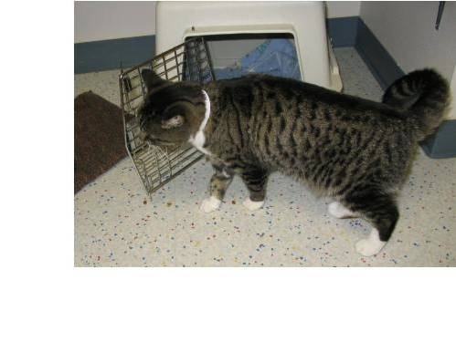
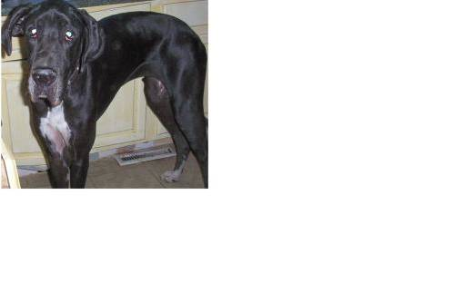
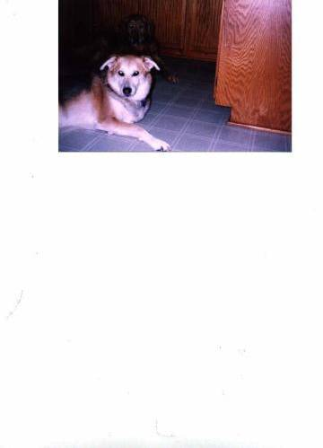

# dogs-vs-cats
dogs-vs-cats-redux-kernels-edition

    本项目将使用迁移学习的方式创建CNN模型来参加Kaggle的dogs-vs-cats比赛项目，该项目向我们提供了25000张带标签的猫狗照片作为训练集，以及12500张猫狗照片作为测试集。
    拿到训练集粗略看了一下训练集照片，发现存在一些这样的照片
    
    
    
    所以第一步我们要进行数据清洗
    巨大的白色边缘会导致图片裁剪时无法剪到完整的猫狗图片。

