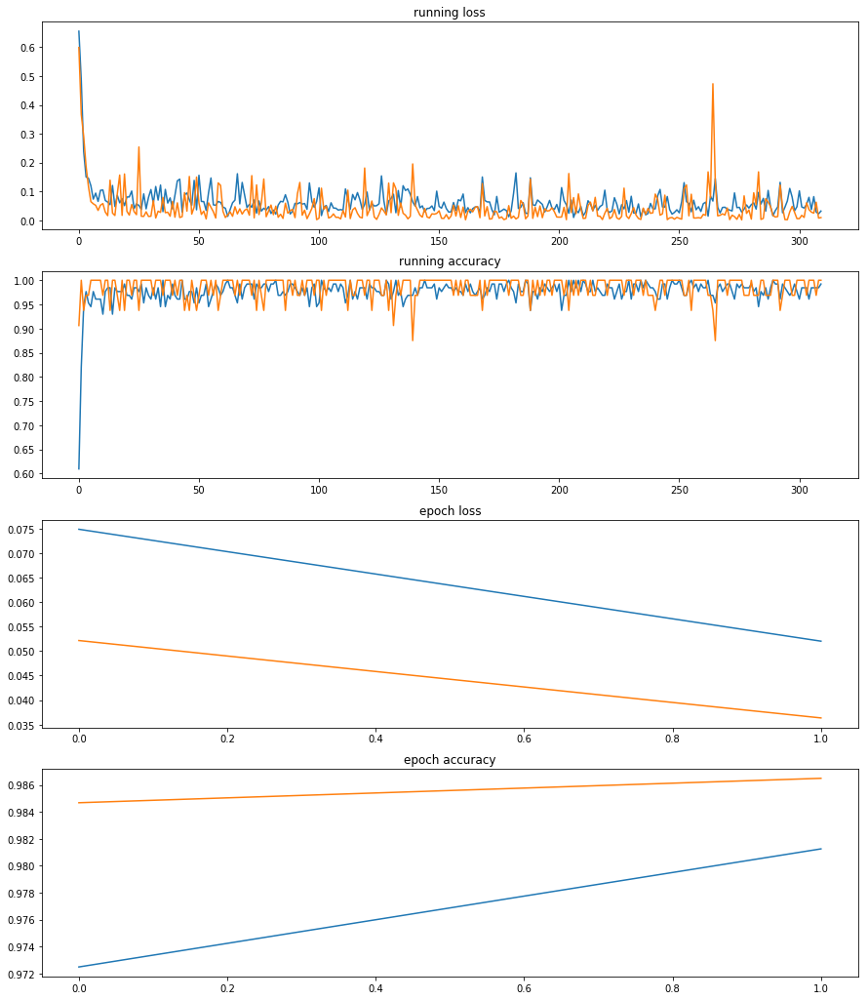
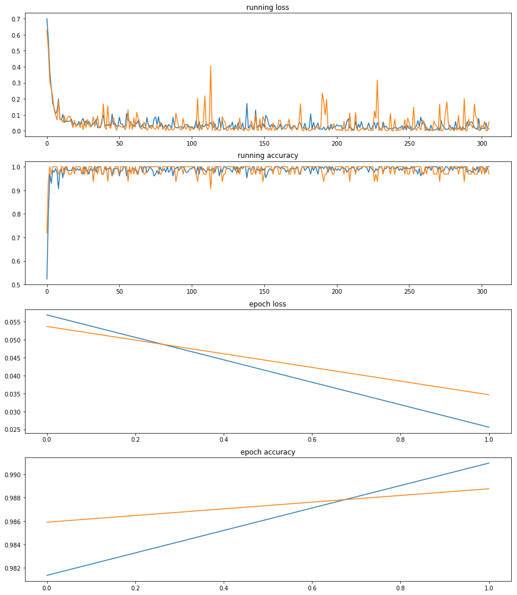

# dogs-vs-cats-redux-kernels-edition

## 项目概述  

本项目是Kaggle上的一个图片分类任务Dogs vs. Cats，要解决的是一个计算机视觉领域的图像分类问题。该项目向我们提供了25000张带标签的猫狗照片作为训练集，以及12500张无标签猫狗照片作为测试集，通过训练一个猫狗分类模型，来预测这12500张无标签图是狗的概率。  

## 问题陈述 

- 由于训练集存在异常图片，先要清洗数据，筛除异常值。  

- 使用pytorch、cv2、PIL等第三方库创建并训练CNN模型，通过迁移学习的方式，实现图片分类器。  
模型结构：ResNet50和Inception_v3预训练模型作为特征提取器，合并两个输出特征，通过全连接层输出分类结果。  

## 评价指标  

原题使用交叉熵loss值作为评估指标，值越小说明模型拟合的分布越接近真实分布，模型表现越好。  

交叉熵损失函数公式定义如下：  

	
# Ⅰ.数据预处理  

### 1、观察数据  

肉眼观察训练集，发现存在一些这样的照片：  

***非猫狗图片***  

***人比狗多***  

***巨大白边***  

一些背景复杂、猫狗占比过小、分辨率过小，或者根本就不是猫狗的图片混杂在训练集中，这会让模型学习到垃圾数据。  

### 2、读取图片  

将数据集整理成(path,label)格式。  
path：文件路径  
label：根据文件名判断出来的标签。  
    
### 3、分割训练集和验证集  
为保证模型能够均衡学习猫狗特征，我们使用数量相等的猫狗图片来训练，猫狗各取80%，剩下20%作为验证集。  
    
### 4、图片变换  
使用torchvision.transforms.Compose( )来组合图片变换函数。图片要分别输入两个子模型，但两个子模型要求的输入尺寸不一致(ResNet50：3 × 224 × 224，Inception_v3：3 × 299 × 299)，为保证输入的是相同图片，变换组合中没有使用随机元素，只是用了CenterCrop，这样裁剪出来的将是同一张图的不同尺寸。  

- 定义批次变换函数**batch_transform**：  
**输入：** batch路径和transform  
**输出：** (batch, Channel, width, height)。  

- 使用torch.utils.data.DataLoader( )加载图片。  

**变换后的图片展示如下**：  
  

# Ⅱ.搭建网络  

### 1、定义网络  
定义混合模型类FusionNet，该类包含预训练CNN模型：**ResNet50**和**Inception_v3**，因为预训练的参数已经很好，我们只对模型finetune。  
根据情况冻结模型前面几层参数，关闭Inception_v3的辅助分支，融合ResNet50和Inception_v3的特征，在其后添加自定义的fully connected layer。  

### 2、损失函数  
原题使用***binary cross entropy loss***作为评分函数，我们选择torch.nn.CrossEntropyLoss( )作为损失函数，loss计算方式将与原题一致。  

### 3、优化器  
- 使用随机梯度下降(SGD)算法优化  

- 第一次尝试训练只训练全连接层的参数  
optimizer=torch.optim.SGD(model.classifier.parameters( ),lr=0.001,momentum=0.92)  

- 用lr_scheduler控制学习率  
scheduler=torch.optim.lr_scheduler.StepLR(optimizer,step_size=1,gamma=0.1)  

# Ⅲ.训练模型  

### 1、先用带杂质的训练集训练模型  
因为训练集97%以上都是正常图片，异常只占很小一部分。  
  

### 2、用训练过的模型预测每一个训练样本的loss，清除loss大于阈值的样本。  
经过两轮epoch训练，模型准确率已达97%，学到的特征偏向于占绝对优势的正常图片，而此时loss仍然大于0.3567（预测概率不超过70%）的样本，十有八九是异常值：非猫狗图片、像素模糊、颜色深暗、背景复杂、角度刁钻，或者一张图同时存在猫和狗 (**这是我肉眼观察时所没有发现的**)。  
  

### 3、使用清洗过的训练集重新训练初始模型  
对于深度学习网络来说，前面的层学习到的特征泛化能力较强，越往后面的层，越专注于原始数据，所以这里我们打开子网络(ResNet50和Inception_v3)最后一层的参数训练，以拟合我们现在所要学习的数据集。  

optimizer=torch.optim.SGD(  
[{'params':model.classifier.parameters()},  
                           {'params':model.resnet.layer4.parameters(),'lr':init_lr*0.1},  
                           {'params':model.inception.Mixed_7c.parameters(),'lr':init_lr*0.1},  
                           {'params':model.inception.Mixed_7b.parameters(),'lr':init_lr*0.1},  
                           {'params':model.inception.Mixed_7a.parameters(),'lr':init_lr*0.1}],  
                          lr=init_lr,momentum=0.91)  
			  
- **评价指标如下：**  
  

# Ⅳ.预测  

- 用训练好的模型预测测试集，对输出使用Softmax函数，得到维度(batch,2)的Tensor，第二列(索引[:,1])便是图片为狗的概率。  

- 结果：
上传至kaggle计算评分，最后获得XXX的成绩
    
# Ⅴ.对本项目的思考  

- 模型相对于这个二分类问题来说有些复杂，数据拟合很快，也很容易过拟合，需要用非常小的学习率慢慢逼近最低loss。
- 训练集中异常数据非常多，刚开始我根本没有在意，以为应该增加模型复杂度，来更好拟合数据，殊不知在某些任务中清洗数据可能比构建复杂模型更为重要。
